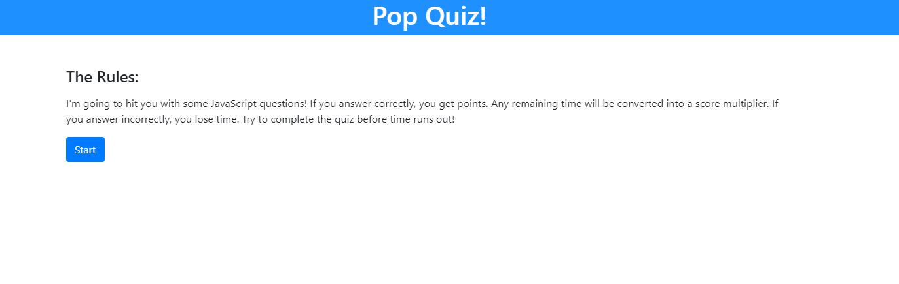

# Coding Quiz! 

## Github Links
https://github.com/CodySamuels/code-quiz

https://codysamuels.github.io/code-quiz/

## User Story

```
AS A coding bootcamp student
I WANT to take a timed quiz on JavaScript fundamentals that stores high scores
SO THAT I can gauge my progress compared to my peers
```

## Acceptance Criteria

```
GIVEN I am taking a code quiz
WHEN I click the start button
THEN a timer starts and I am presented with a question
WHEN I answer a question
THEN I am presented with another question
WHEN I answer a question incorrectly
THEN time is subtracted from the clock
WHEN all questions are answered or the timer reaches 0
THEN the game is over
WHEN the game is over
THEN I can save my initials and score
```

## Introduction

The deployed application is short multiple choice quiz. The HTML designed to be mobile-friendly.
The start button launches the quiz portion. The quiz has a knock out function, which removes an option from the quiz whenever the wrong selection is made.
Clicking the right answer will progress the quiz to the next question. 

Once the user answers the final quest, it advances to a "final" screen, where they input their desired username for the scoreboard. Their final score is based off how much time was used. The application captures the user data, and advances to the scoreboard where their score and username is displayed.


## Known Issues

The timer starts on page launch. If the user doesn't start the quiz, the form will become unhidden, and will error the quiz.

There's an error in the javascript when it goes to populate the scoreboard. It registers an undefined, but will populate the scoreboard correctly.

## Screenshots


Start screen. with functioning button that launches the quiz.
***


Screenshot of the quiz in progress. Showcases the "incorrect" knockout option.
***


Scoreboard populated with locally stored data.
***